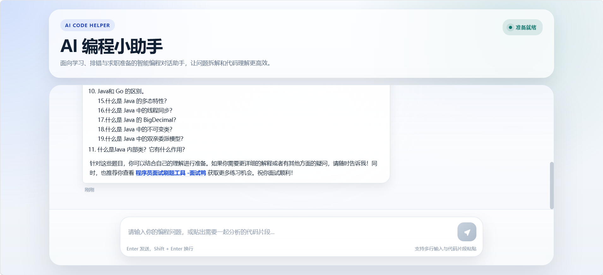

<!--
  README for AI Code Helper
  Generated: 2026-05-27
-->

# AI Code Helper

轻量级的 AI 编程助手，包含后端（Spring Boot）和前端（Vite + Vue）。该仓库用于演示本地运行与快速展示，适合用于学习、排错与求职准备场景。

<!-- Badges (replace with real ones if desired) -->

[](#)
[](#)

## 目录

- 项目简介
- 技术栈
- 功能
- 快速开始（本地运行）
- 截图演示
- 部署建议（可选）
- 贡献与联系
- 许可

## 项目简介

AI Code Helper 是一个示例项目，将一个 Spring Boot 后端与一个基于 Vite 的 Vue 前端组合，提供聊天式编程助手功能（示例用于教学与演示）。

后端目录：`src/main/java/com/yupi/ai_code_helper`

前端目录：`ai-code-helper-frontend`

项目包含的资源：
- `system-prompt.txt`（系统提示）
- `application.yml` / `application-local.yml`（Spring Boot 配置）

## 技术栈

- 后端：Java 17, Spring Boot, Maven
- 前端：Vue 3, Vite, npm
- 开发工具：IntelliJ IDEA 推荐


## 截图演示

项目中已经包含演示图片，位于 `src/main/resources/images/`：

```
src/main/resources/images/one.png
src/main/resources/images/tow.png
```

仓库根的 README 已引用这些图片（如下所示），因此无需复制到 `docs/images/`：




如果你想添加或替换图片，请将图片放到 `src/main/resources/images/` 下，然后提交：

```powershell
# 示例（Windows PowerShell）：
Copy-Item -Path "C:\Users\<you>\Pictures\screenshot-1.png" -Destination .\src\main\resources\images\one.png -Force
Copy-Item -Path "C:\Users\<you>\Pictures\screenshot-2.png" -Destination .\src\main\resources\images\tow.png -Force

git add src/main/resources/images/one.png src/main/resources/images/tow.png README.md
git commit -m "Update demo screenshots"
git push origin main
```

（若默认分支不是 `main`，请把 `main` 替换为你的分支名。）
```powershell
cd D:\CODE\ai_code_helper
```

2) 启动后端（开发模式）

```powershell
# 使用仓库里的 mvnw.cmd（Windows）
.\mvnw.cmd spring-boot:run

# 或者先打包再运行
.\mvnw.cmd -DskipTests package
java -jar target\ai-code-helper-*.jar
```

后端默认端口：8081（请在 `application.yml` 中确认或修改）。

3) 启动前端（开发模式）

```powershell
cd ai-code-helper-frontend
npm install
npm run dev
# 访问由 Vite 提供的地址，通常是 http://localhost:5173
```

4) 测试

- 在浏览器打开前端地址（例如 http://localhost:5173），在 UI 中输入问题，观察后端日志与前端交互结果。

## 截图演示

把本地运行的截图放入 `docs/images/`，并在下面替换图片文件名。仓库已在 `README` 顶部引用占位图。示例占位：


如果你尚未添加图片，可以用 Windows 的截图工具（Win + Shift + S），然后把图片保存到 `docs/images/`，并提交到仓库：

```powershell
New-Item -ItemType Directory -Path docs\images -Force
Copy-Item -Path "C:\Users\<you>\Pictures\screenshot-1.png" -Destination .\docs\images\ -Force
git add docs/images README.md
git commit -m "Add demo screenshots and README"
git push origin main
```

（若默认分支不是 `main`，请把 `main` 替换为你的分支名。）

## 部署建议（可选）

- 前端：可以部署到 GitHub Pages（`ai-code-helper-frontend/dist`），或使用 Netlify/Vercel。推荐使用 GitHub Actions 自动构建并将 `dist` 发布到 Pages。
- 后端：可部署到 Render / Railway / Heroku 等。构建命令一般为 `./mvnw -DskipTests package`，启动命令为 `java -jar target/*.jar`。
- CORS：若把前端与后端分别部署，需要在后端的 `CorsConfig.java` 中允许前端域名访问。

## 贡献与联系

欢迎提交 issue 或 pull request。常见贡献流程：

1. Fork 仓库
2. 新建分支 `feature/your-feature`
3. 提交并创建 PR

如需快速联系，请在仓库 issue 中留言。

## 许可

本仓库示例代码使用 MIT License（如需其他许可，请修改 `LICENSE` 文件）。

--

如果你希望我进一步：
- 把 `docs/images/.gitkeep` 添加到仓库以便跟踪空目录（我可以现在创建）；
- 生成 `.gitignore`（Java + Node + IDEA）并提交；
- 添加一个 GitHub Actions workflow 模板用于自动部署前端到 Pages。


